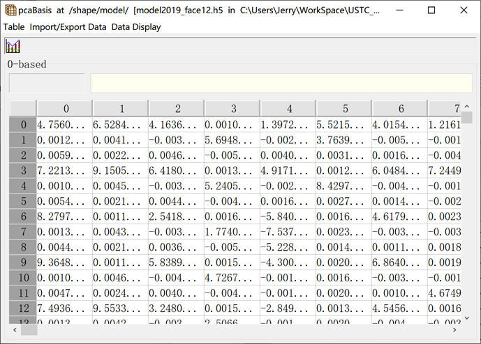
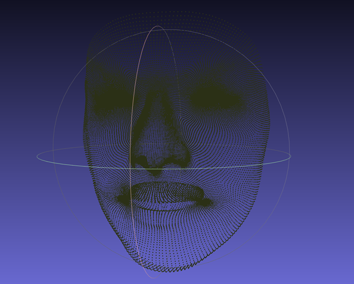
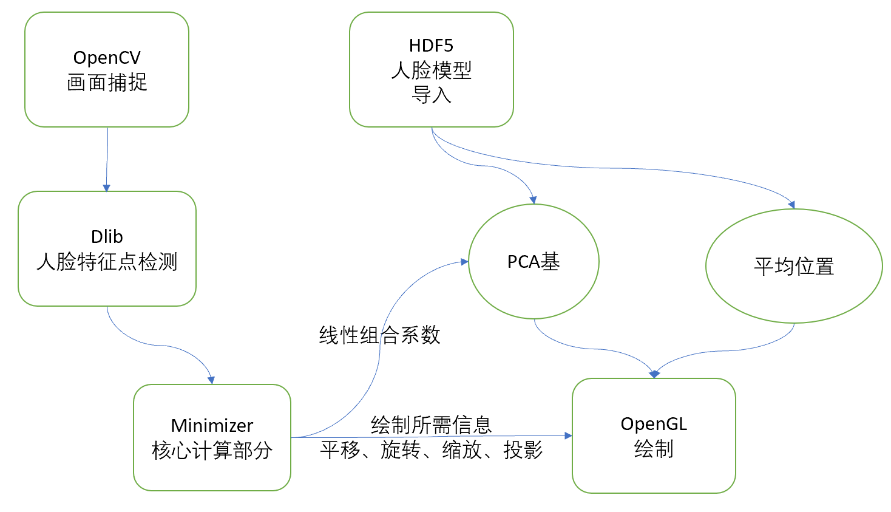
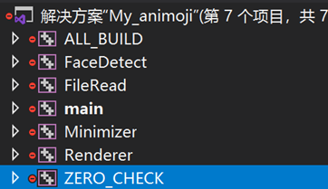
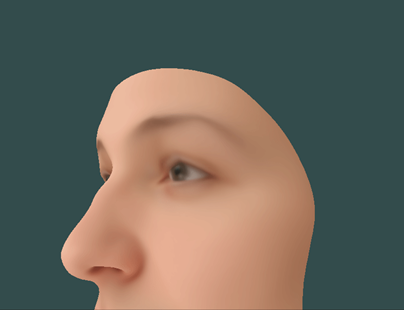
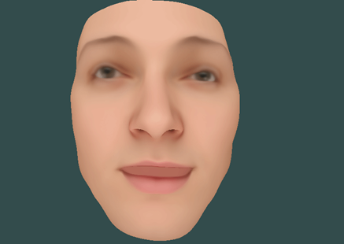

# 基于单张图片的人脸三维重建

PB17081531 沈鹏飞

### 背景

#### 3DMM方法

- 将人脸的Mesh视为一系列PCA基的线性组合

- $$
  S=\bar{S}+A_{i d} \alpha_{i d}+A_{e x p} \alpha_{e x p}
  $$

- 通过一系列信息来拟合系数$\alpha$，进而改变Mesh的形状

- 调整系数，找到人脸相似的Mesh即为所需要的结果

#### 信息获取

目前常见的获取方式有很多种。大约可以包括以下几种

- 3D结构光，主要代表包括Apple的FaceID，Intel的RealSense 3D摄像头，以及为了游戏而生的XBox Kinect等。
- 通过特征点来进行，比如在人脸上做二维的特征点标记，更加昂贵一点的可以进行动作捕捉的三维标记。代表作就是电影《阿丽塔：战斗天使》。
- 输入单张图片，通过机器学习的方法标注图片中的特征点并进行拟合

### 算法简介

#### Loss function

$$
s_{2 d_{-} \operatorname{land}}=f P R\left[\bar{S}+A_{i d} \alpha_{i d}+A_{e x p} \alpha_{e x p}+t_{3 d}\right]_{\text {land }}
$$

以上是将3D模型投影到平面上的对应关系。$f$为缩放系数，$P$为投影矩阵，$R$为旋转矩阵，$t$为模型在三维空间中的移动。

线性组合系数和三维移动的参数都通过优化理论学习出来。

Loss function为
$$
\arg \min _{f, R, t_{3 d}, \alpha_{i d}, \alpha_{e x p}}\left\|s_{2 d t}-s_{2 d}\right\|
$$

#### 算法流程

发现学习的参数可以划分成两部分：线性组合系数和三维变换参数。将这两部分交替优化，迭代进行来达到最优。

特征点的提取使用现有的包来进行，通过开源工具DLib可以提取68个特征点在二维平面的坐标。

首先考虑相机部分。

相机的视角采用 *Golden standard algorithm*，将所有的三维变换等效成为一个4*3的矩阵，记作$P$，计算完成后再进行分解、

流程如下：

1. 将二维点和三维点进行相似变换来归一化：$\tilde{\mathbf{x}}_{i}=\mathrm{T} \mathbf{x}_{i}$，$\tilde{\mathbf{X}}_{i}=\mathrm{UX}_{i}$

2. P的第三行为(0,0,0,1)，将$P$的前两行压平为1*8的矢量。

3. 按此公式计算P中元素的大小，求解矛盾方程组
   $$
   \left[\begin{array}{cc}
   \tilde{\mathbf{X}}_{i}^{\top} & 0^{\top} \\
   0^{\top} & \tilde{\mathbf{X}}_{i}^{\top}
   \end{array}\right]\left(\begin{array}{c}
   \tilde{\mathbf{P}}^{1} \\
   \tilde{\mathbf{P}}^{2}
   \end{array}\right)=\left(\begin{array}{c}
   \tilde{x}_{i} \\
   \tilde{y}_{i}
   \end{array}\right)
   $$
   
4. 解除归一化
   $$
   \mathrm{P}_{\mathrm{A}}=\mathrm{T}^{-1} \tilde{\mathrm{P}}_{\mathrm{A}} \mathrm{U}
   $$

然后进行人脸参数的拟合，使用最小二乘拟合。

#### 数据简介

数据使用Bazel face model。

- 包含199维的Shape PCA基和100维的Expression PCA基，数据中还包含了这些基的Variance。
- 人脸特征点未进行标注，需要进行手动标注点的对应关系。这一点可以在源代码中看到。
- 人脸Mesh包含10000多个面，20000多个点

#### 程序结构

- 项目使用C++实现
- 使用简单的观察者模式
- 项目通过Cmake管理，外部依赖库没有设置cmake自动安装，需要手动编译安装
- 总代码量1300余行

### 结果与讨论

#### 结果

具体动态结果可以看GIF附件。

#### 存在的问题

- PCA Basis的降维问题
  - PCA的维数有几百，而特征点的数量只有68
  - 传统的降维方法都出现了各种问题，不能表现出某一个部分的变化
  - 最终的项目还是保留了所有的PCA Basis，并且加大了对于线性组合参数的Penalize，以防止严重的过拟合
- 人脸边缘点的对应关系需要手动标注且不能动态调整，在绘制之前需要较大的人工工作量来进行标注
- 皱纹、面部瑕疵无法反映，不过这一部分已经不再是人工智能的范畴，更多的需要图形学的优化

#### 未来的工作

- 根据亮度来提取Micro Expression的信息
- 根据多张图片提取3D信息
- 根据局部色彩提取面部瑕疵的信息
- 提取图片中的人脸作为Texture进行渲染