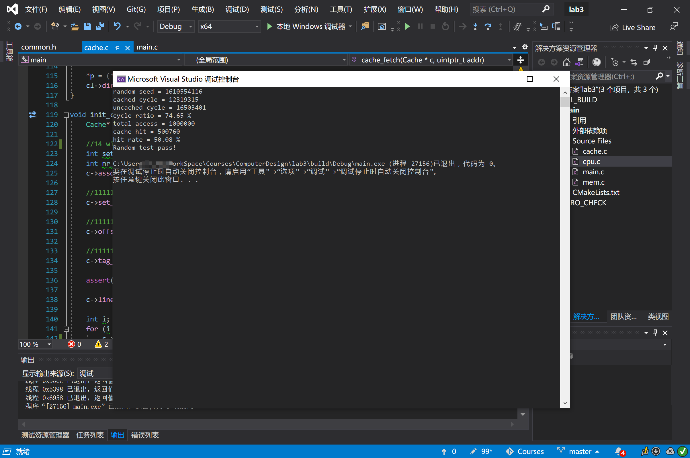
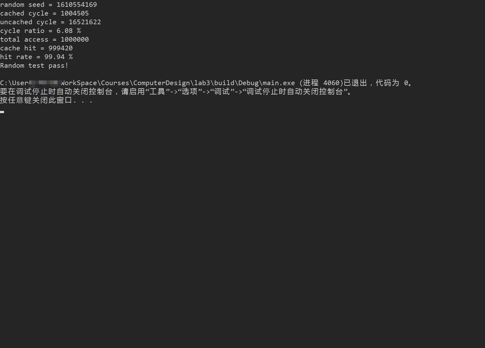

# 实验3

PB17081531 沈鹏飞

### 算法简介

```c
bool cache_query(Cache* c, uintptr_t addr, CacheLine** hit_cl)
{
    uint32_t tag = addr & c->tag_mask;
	int N = exp2(c->associativity_width);
	int set_index = N * (c->set_mask & addr) >> BLOCK_WIDTH;

	for (int i = 0; i < N; ++i)
	{
		if (c->line[i + set_index].valid)
		{
			uint32_t cache_tag = get_tag(c->line[i + set_index].tag);

			if (tag == cache_tag)
			{
				*hit_cl = &(c->line[i + set_index]);
				return true;
			}
		}
	}

	*hit_cl = &(c->line[rand() % N + set_index]);
	return false;
}
```

组相联宽度导致$2^n$个为一组，在一组内进行比较，对valid的CacheLine比较tag；如果hit则直接返回，否则任意返回一个。

```c
CacheLine* cache_fetch(Cache* c, uintptr_t addr) {
	CacheLine* cl;
	if (cache_query(c, addr, &cl)) {
		hit_increase(1); //cache hit

		return cl;
	}

	if (cl->dirty)
	{
		int set_index = (addr & c->set_mask);

		mem_write((set_index | get_tag(cl->tag)) >> BLOCK_WIDTH, cl->sram);
	}
	mem_read(addr >> BLOCK_WIDTH, cl->sram);

	cl->tag = c->tag_mask & addr;
	cl->valid = true;
	cl->dirty = false;

	return cl;
}
```

使用dirty来标记是否被写过，如果被写过就存进内存中再fetch，如果没有被写过就直接从内存中fetch新的块。新fetch的块将dirty标为false。

### 框架代码分析

此次作业的框架较为完整，但在阅读过程中还是遇到了一些障碍。主要是C语言本身封装不完整，对于接口也没有办法进行清晰的标记。

我将makefile改写成了CMakeList，通过在Visual Studio中调试来观察程序的执行过程，进而了解程序的功能。

默认参数中块大小为64个char，可以存16个int，通过与0x3进行取与来进行4个char的跨度选择。

通过几个mask和位运算来进行不同位置的选择。

Cacheline里面的Union的设计挺有意思，将最低为作为valid的标记，然后再使用一个较大的Union来完整地初始化。

代码中还有一些注释，作为对于框架的分析。

gcc支持void*的写法，但是国际标准C不支持，gcc中void\*在取加号的时候stride就是一个byte，所以可以使用任意大小为1个byte的指针来代替。

### 运行结果



增大Cache的大小：



可以发现hit rate大幅增加。

### 思考题

> 为什么在本次实验中是否使⽤ cache 的性能⽐较，在框架⽤专⻔计数周期数作为时间的体 现，⽽不是真实运⾏时间？

因为此实验中的cache是跑在内存中的模拟，并没有真正运行在高速的cache上，所以用时间做benchmark并不合理，而应该采用自定义的方式来进行。