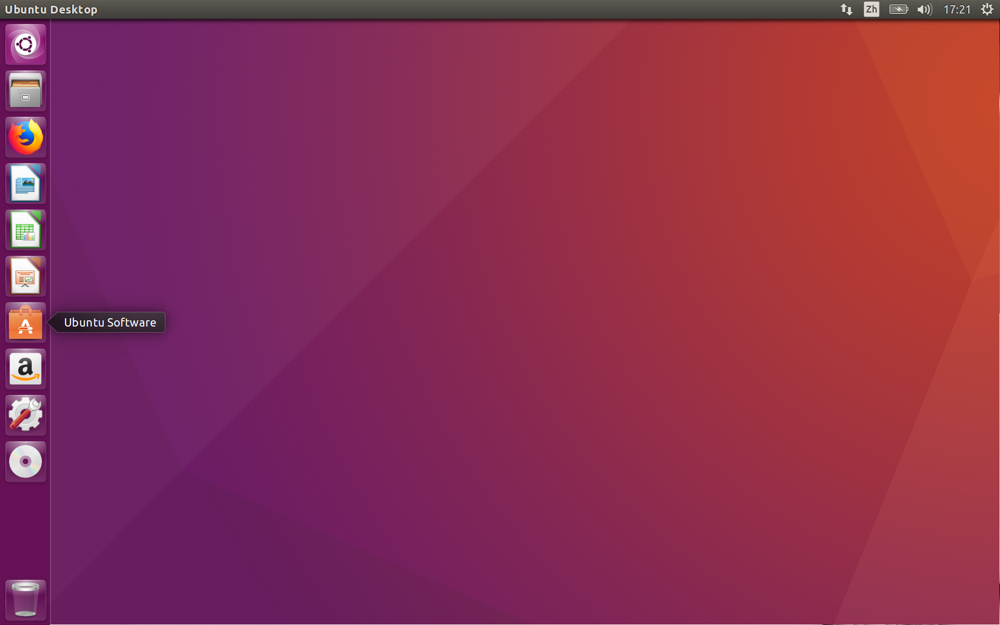

# 实验1 建立环境

### 实验要求

1. 使用 VirtualBox 虚拟机建立网络信息安全实验环境；
2. 配置虚拟网卡，虚拟机使用多个虚拟网卡进行通信；
3. 安装及配置新的虚拟机；
4. 使用已经安装好的虚拟机。

### 实验流程

#### Virtual box 安装

#### 网卡配置

由于Windows的限制，无法创建ipv4第四部分为0的网络。

### 虚拟机安装

#### Windows

#### Ubuntu

### 命令行使用

#### Ubuntu

#### Windows

### 上机实践

nmap扫描：

共享磁盘映射功能出现系统版本过老问题：

希望老师、助教能够理解。

### 结果讨论

配置环境实在是一个繁琐的事情，会有很多坑需要踩一遍。