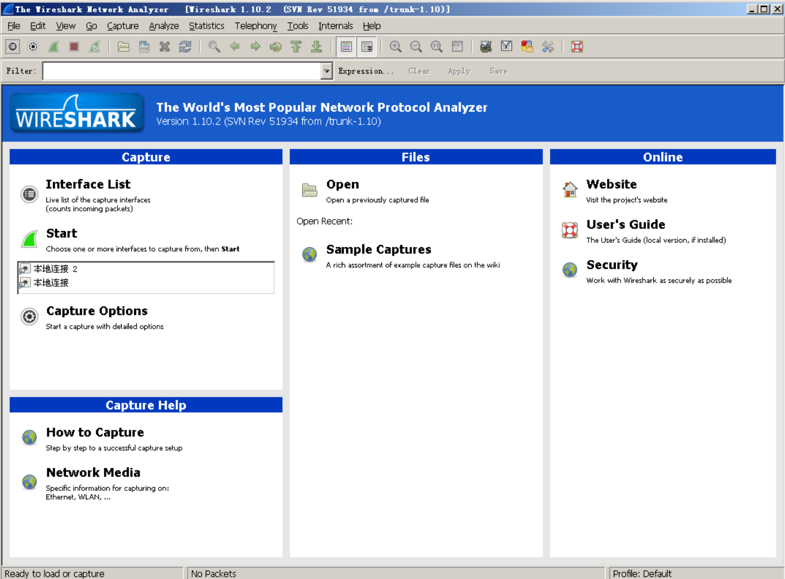
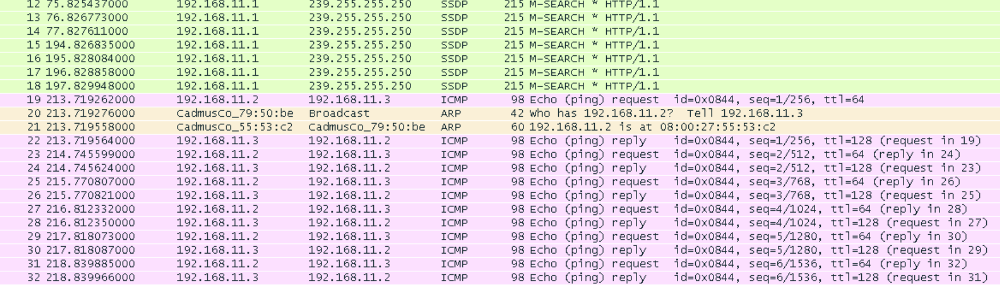
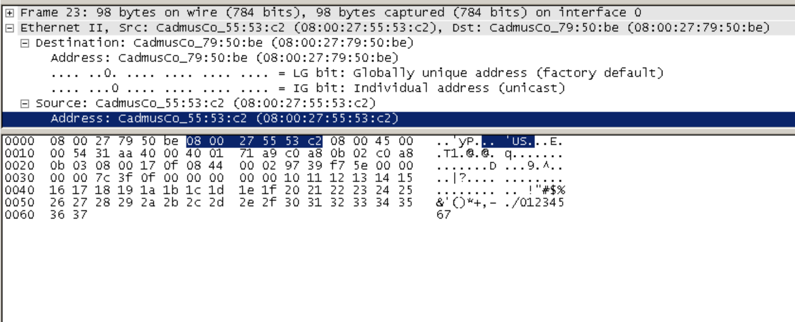
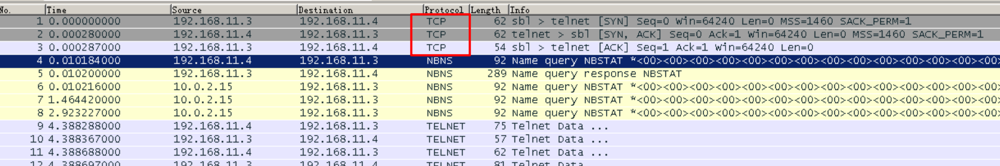
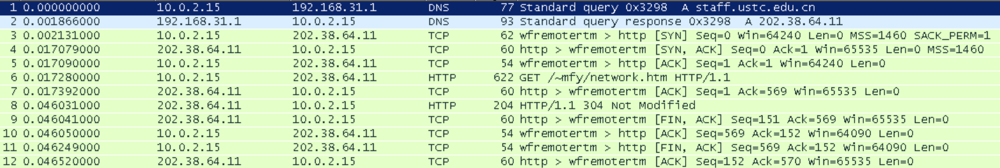

# 实验2 使用WireShark分析报文

### 实验要求

1. 掌握网络协议分析器与仿真编辑器的使用方法；
2. 用 wireshark 分析以数据链路层、网络层和传输层的网络协议单元的结构、理解网络
   协议的工作过程。

### 实验准备

#### Wireshark

### 上机实践

下面是使用Ubuntu来ping Windows Server的结果。

对报文进行分解，前6位为源地址，之后是目的地址，在一些控制信息后出现真正的数据，长度大约占一般，数据是可读的符号数字序列。

#### Telnet

可以看到TCP协议三次握手的过程。

### 实验过程

访问课程主页，得到的报文结果如下。

### 结果分析

首先分析各个报文的目的。

1. 报文1和2通过DNS服务器查询网址对应的ip地址
2. 345是TCP三次握手
3. 报文6由浏览器向服务器发送请求
4. 报文7发送控制协议
5. 由于此页面曾被加载过一遍，本地有缓存，因此报文8的内容是“自上次加载未进行更新”，否则应该是报文内容
6. 9到10四次握手断开连接