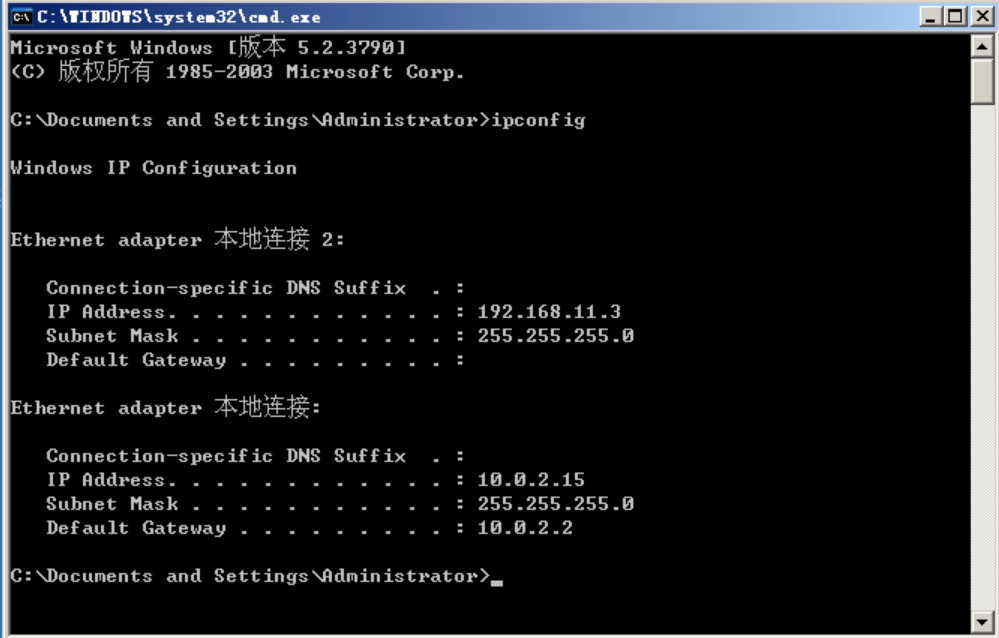
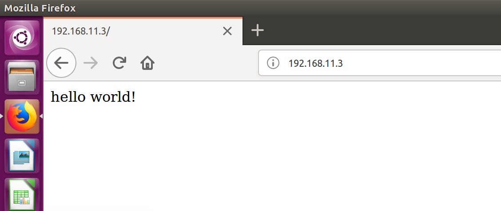
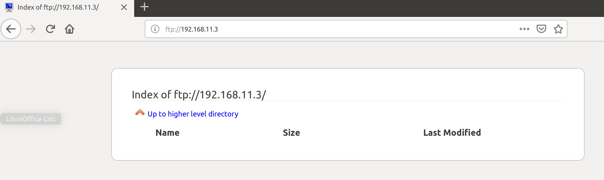

# 建立Web服务器

### 实验目的

Windows 2003 系统中 Web 服务器、 ftp 服务器、路由和远程访问服务器的配置。

### 实验流程

#### Web服务器

虚拟机状态：

第一个是Host-Only，第二个是NAT网络。

按照说明配置好后，访问结果如下：

从Ubuntu也可以访问。

从主机也可以访问：

Web服务器完成。

#### ftp服务器

### 结果讨论

主要调用了Windows Server提供的各种选项，比较简单。