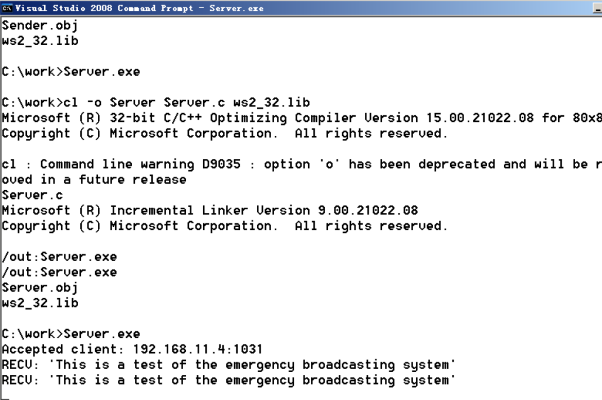
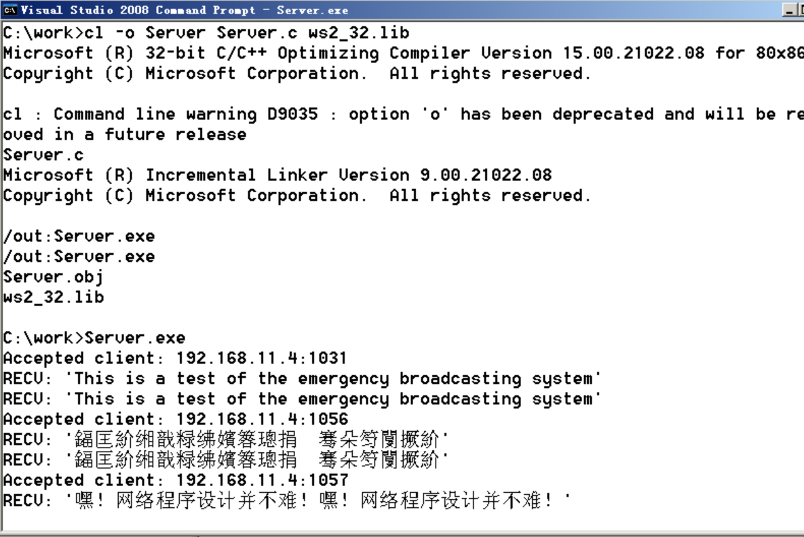

# 建立Web服务器

### 实验目的

掌握网络程序的设计方法。

### 实验原理

套接字（socket ）接口是 TCP/IP 网络的 API 接口函数，最先应用于 Unix 操作系统，目前已成为网络程序设计的标准接口。
socket 函数原型为：

```c
 int socket(int domain, int type, int protocol) 。
```

面向传输层的常用的Socket 类型有两种：流式 Socket SOCK_STREAM）和数据报式 Socket SOCK_DGRAM）。流式 Socket 是一种面向连接的 Socket，针对于面向连接的TCP 服务应用；数据报式 Socket 是一种无连接socket，对应于无连接的 UDP 服务应用。

### 实验流程

#### UDP

发送端：


接收端：


发现最开始传送的一些消息丢失了，表明UDP的传送的数据完整性不能保证。

#### TCP

Server：



Client：


### 修改程序




找到合适的编码后，我们就会发现，嘿！网络程序设计并不难！