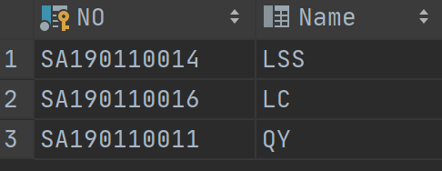

​	

# 教师-学生数据库

### 载入结果

#### Student

```mysql
create table Student
(
    NO       char(15) not null,
    NAME     char(5) null,
    SEX      char(6)  null,
    BIRTHDAY char(20) null,
    DEPART   int      null,
    constraint Student_pk
        primary key (NO)
);
```


#### Teacher

```mysql
create table Teacher
(
    NO       char(10) not null,
    NAME     char(5) null,
    SEX      char(6)  null,
    BIRTHDAY char(25) null,
    PROF     char(30) null,
    DEPART   int      null,
    constraint Teacher_pk
        primary key (NO)
);
```


#### Course

```mysql
create table Course
(
    CNO   int      null,
    CNAME varchar(40) null,
    TNO   char(10) null
);


create unique index Course_CNO_uindex
    on Course (CNO);

alter table Course
    add constraint Course_pk
        primary key (CNO);
        
alter table course
    add constraint course_fk
        foreign key (TNO) references Teacher (NO);
```


#### Score

```mysql
create table Score
(
    NO     char(15) null,
    CNO    int null,
    DEGREE int null,
    constraint Score_pk
        unique (NO, CNO),
    constraint Score_course_CNO_fk
        foreign key (CNO) references course (CNO),
    constraint Score_student_NO_fk
        foreign key (NO) references student (NO)
);
```


### 习题

#### 1

```mysql
alter table student add column CLASS char(20) default 1;
```


#### 2

```mysql
alter table Student modify column class INT;
```


#### 3

```mysql
update student set class=DEPART-10;
```


#### 4

```mysql
alter table student modify column SEX enum('male','female');
```


#### 5

```mysql
create table course_ave
(
	CNO int not null,
	TNO char(10) not null,
	AVE double null,
	constraint course_ave_pk
		unique (CNO, TNO),
	constraint course_ave_course_CNO_fk
		foreign key (CNO) references course (CNO),
	constraint course_ave_teacher_NO_fk
		foreign key (TNO) references teacher (NO)
);
select * from  course_ave;
```


#### 6

```mysql
alter table course_ave add constraint primary key(CNO);
```
#### 7

```mysql
alter table course_ave modify TNO char(10) not null ;
```
#### 8

```mysql
insert into course_ave
select Course.CNO,Teacher.NO,AVG(DEGREE)
from Teacher,
     course left outer join score on Course.CNO = Score.CNO
where Teacher.no = Course.TNO group by CNO;
```


#### 9

```mysql
delete from course_ave where AVE is null ;
```


#### 10

```mysql
alter table course_ave drop constraint course_ave_course_CNO_fk;
alter table course_ave drop constraint course_ave_teacher_NO_fk;
insert into course_ave values('20201100','TA80000',80);
```


#### 11

```mysql
update course_ave set AVE=75 where CNO='20201100';
```


#### 12

```mysql
create index  CNAME_INDEX on COURSE(CNAME);
```


#### 13

```mysql
create unique index  NO_index on Student(NO);
```


#### 14

```mysql
create index NODE_index on score(NO asc ,DEGREE desc );
```


#### 15

```mysql
show indexes from course;
```


#### 16

```mysql
drop index CNAME_INDEX on course;
```


#### 17

```mysql
select count(*)
from student,
     course,
     teacher,
     score
where Student.NO = Score.NO
  and Score.CNO = Course.CNO
  and Course.TNO = Teacher.no
  and Teacher.DEPART = 18;
```


#### 18

```mysql
select NO, NAME
from Student
where DEPART = (select DEPART from student where NAME = 'XY');
```


#### 19

```mysql
select * from student order by DEPART desc,NO asc;
```


#### 20

```mysql
select Student.NO, NAME, DEGREE
from Student,
     score
where Student.NO = Score.NO
  and DEGREE >= 80;
```


#### 21

```mysql
select Student.NO, Student.Name
from Student,
     Teacher,
     score,
     course
where Student.no = Score.no
  and Score.cno = Course.CNO
  and Course.TNO = Teacher.NO
  and Teacher.NAME = 'LJL';
```



#### 22

```mysql
select Student.no, DEGREE
from student,
     score,
     course
where Student.No = Score.NO
  and Score.Cno = Course.CNO
  and Course.CNAME = 'Database'
order by DEGREE desc;
```


#### 23

```mysql
select Course.cno, CNAME, avg(DEGREE)
from course,
     score
where Score.cno = Course.cno
group by cno;
```


#### 24

```mysql
select NO, NAME
from student
where 80 > any (select degree from score where Student.no = Score.NO);
```


#### 25

```mysql
select s1.NO, Name, AVG(DEGREE)
from Student s1,
     score sc1
where 3 <= (select count(*)
            from  score
            where s1.NO = Score.NO) group by NO;
```


#### 26

```mysql
select CNAME, count(*)
from course,
     score
where Course.CNO = Score.CNO
group by CNAME;
```


#### 27

```mysql
select NAME
from student
where not exists(select *
                 from score,
                      course
                 where Course.CNAME = 'Operating_System'
                   and Score.CNO=Course.CNO
                   and Student.no = Score.NO)
```


#### 28

```mysql
select NAME, 2020 - BIRTHDAY
from student
where (2020 - Student.BIRTHDAY) <= 24;
```


#### 29

```mysql
select *
from student
where Student.NAME like '%Y';
```


#### 30

```mysql
select Student.NO, NAME, DEGREE
from score sc1,
     student
where sc1.NO = Student.NO
  and DEGREE <
      (select AVG(DEGREE)
       from score sc2
       where sc2.CNO = sc1.CNO);
```


#### 31

```mysql
create view db_student_score as
select Score.CNO, Score.NO, Score.DEGREE
from score,
     course
where Score.Cno = Course.CNO
  and Course.CNAME = 'Database'
with check option;

select * from db_student_score;
```


#### 32

```mysql
drop view db_student_score;
```

#### 33.1

```mysql
create table Gender
(
	SEX char(6) not null,
	s_count int null,
	constraint Gender_pk
		primary key (SEX)
);
```


#### 33.2

```mysql
insert into gender
select SEX,count(*) from student group by SEX;
```


#### 33.3

```mysql
create trigger add_one
    after insert
    on student
    for each row
BEGIN
    update gender set s_count=s_count + 1 where SEX = new.SEX;
end;

create trigger del_one
    before delete
    on student
    for each row
BEGIN
    update gender set s_count=s_count - 1 where Gender.SEX = old.SEX;
end;
```


#### 33.4


```mysql
insert into student(NO,SEX) value ('17081531','male');
```


```sql
insert into student(NO,SEX) value ('17081532','female');
```


```sql
delete from student where NO='17081532';
```

